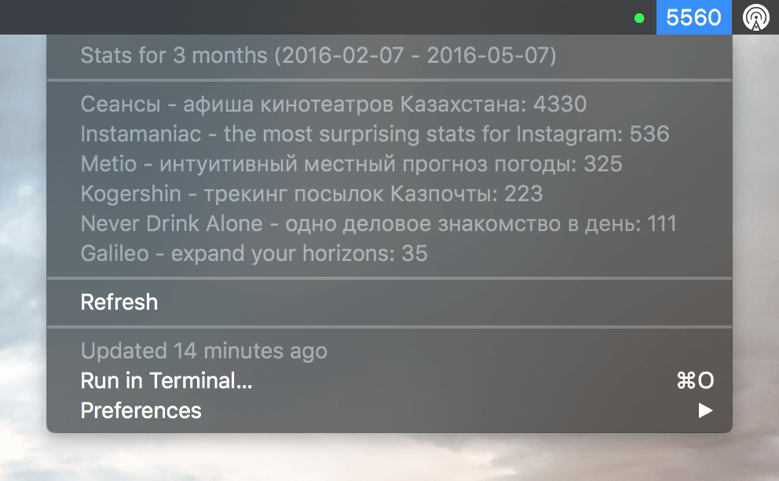

# itc-stats
**A BitBar plugin that shows statistics for your iOS and OS X apps**

[![Build Status][travis-image]][travis-url] [![Dependency Status][daviddm-image]][daviddm-url]



## Installation

1\. Clone the repo somewhere on your computer:

```bash
git clone https://github.com/yenbekbay/itc-stats.git <path-to-itc-stats>
```

2\. Copy `config.json-example` to `config.json` and edit the values to your own. For the start date, you can use [Moment.js shorthands](http://momentjs.com/docs/#/manipulating/) (e.g. 1day, 3months, 5weeks, 2years, ...).

3\. Install all dependencies by running:

```bash
npm install
```

4\. Finally link the plugin to your BitBar plugin directory and set the refresh rate:

```bash
ln -s <path-to-itc-stats>/index.js <path-to-bitbar-plugins>/itc-stats.1d.js
```

5\. Refresh the plugins with BitBar and enjoy your stats. :)

## The MIT License

MIT © [Ayan Yenbekbay](http://yenbekbay.me)


[travis-url]: https://travis-ci.org/yenbekbay/itc-stats
[travis-image]: https://img.shields.io/travis/yenbekbay/itc-stats.svg

[daviddm-image]: https://david-dm.org/yenbekbay/itc-stats.svg?theme=shields.io
[daviddm-url]: https://david-dm.org/yenbekbay/itc-stats
